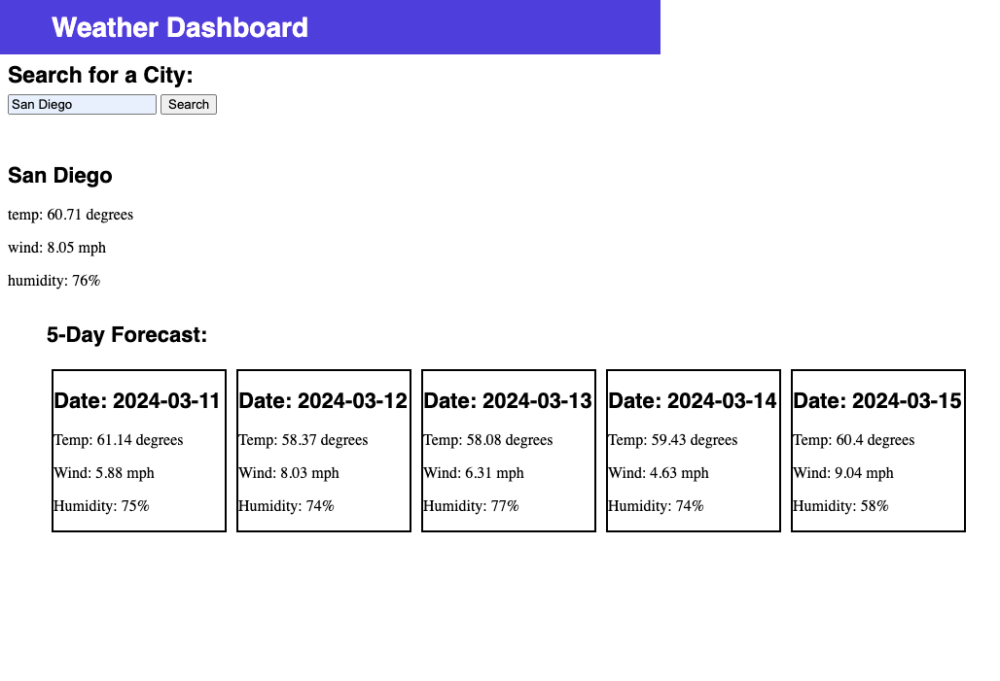

# weather-dashboard

## Description
This repository contains an HTML, CSS, and JavaScript file that work together to create a weather dashboard. The user enters a city into the form on the site and a current forecast and a five day forecast are returned and displayed on the page. The temperature, humidity, and wind speed are displayed in the forecast. The previous searches are saved in localstorage so the user can return to their previous searches. The HTML and CSS files are updated dynamically and are powered by JavaScript. This weather dashboard is perfect for anyone wanting the current and future weather for a city of their choice. 

## Image of the site

## Link to deployed site

https://floconno.github.io/weather-dashboard/

## Acknowledgments

* Xpert, the AI Learning Assistant from EdX was incredibly useful in finding errors in my code and helping me to correct them.
* My tutor Dennis Itua helped me find bugs in my code and fix them and also assisted me in writing lines 74-85.
